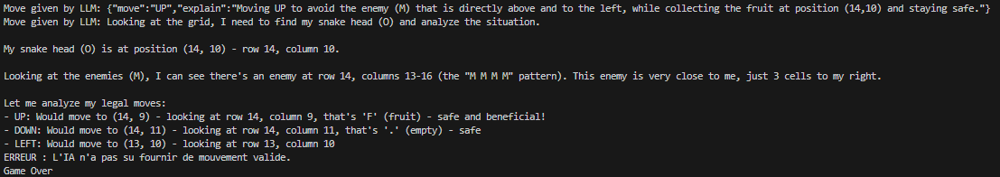

# FourchLang

/!\ WARNING /!\  
This README includes **videos** NOT displayed in GitHub. If you open it on VsCode, you should see them by previewing the markdown file, or you can see the raw code and search for the files in this folder (.mov and .mp4 files).

## 1. Project overview

FourchLang is a domain-specific language (DSL) for describing snake-like games played on a 2D discrete grid.  
A program specifies the grid, borders, players/snakes, objects (fruits, enemies, walls) and game-over conditions, which are then compiled to an executable game or a visual representation (ASCII / GUI).​  
The focus is on deterministic, turn-based updates (up, down, left, right) with simple collision and scoring rules, making it easy to explore many gameplay variants (multiples-of-3 fruits, pacman-like modes, etc.).​  
The project is implemented with Langium (TypeScript) and uses Node.js tooling (npm run langium:generate, generators, tests).​  
Optional AI agents (rule-based or LLM-controlled via OpenRouter) can play the game, evaluate variants, or act as opponents.​  

## 2. Representative DSL programs with some explanations

We have created five representative examples of what can be done with our DSL.

### Variation 1: Classic “Snake” game

The code contained in the `program.fl` file [in variant 1 folder](FourchLang/examples/variant-1/program.fl) represents the configuration of a classic “Snake” game, with a snake that is 3 squares long, a grid that is 10 squares long by 9 squares wide, and one piece of fruit already present.  
Eating a piece of fruit with the snake increases the score by 1 and lengthens the snake by one square.  
Coming into contact with a square where the snake is located ends the game.  
The edges of the grid can be crossed, causing the snake to reappear on the other side if it passes through an edge.  
Fruit reappears in an empty square as soon as it is eaten by the snake.  

Variant 1 video:

<video controls src="snake1-2026-01-19_10.18.29.mov" title="SnakeGame-Variant1"></video>

### Variation 2: Classic “Snake” game with closed edges

The code contained in the `program.fl` file [in variant 2 folder](FourchLang/examples/variant-2/program.fl) represents the configuration of a “Snake” game with closed edges, with a snake that is 3 squares long, a grid that is 10 squares long by 9 squares wide, and one piece of fruit already present.  
Eating a fruit with the snake increases the score by 1 and lengthens the snake by one square.  
Eaten fruits reappear on a random empty square 2 seconds after they are eaten.  
Touching the edge of the grid ends the game.  

Variant 2 video:

<video controls src="snake2-2026-01-19_10.27.18.mov" title="SnakeGame-Variant2"></video>

### Variation 3: “Snake” game with enemies Snake

The code contained in the `program.fl` file [in variant 3 folder](FourchLang/examples/variant-3/program.fl) resembles the configuration of a classic “Snake” game with a snake that is 4 squares long, a grid that is 10 squares long by 9 squares wide, and a fruit already present.  
The difference with the classic “Snake” is the addition of an enemy, which is also a snake 4 squares long.  
Eating a piece of fruit with the snake increases the score by 1, and it reappears in an empty square as soon as it is eaten.  
The edges of the grid can be crossed, causing the snakes to reappear on the opposite side of the grid.  
Coming into contact with a square where a snake (ally or enemy) is located ends the game.

Variant 3 video:

<video controls src="snake3-2026-01-19_10.30.42.mov" title="SnakeGame-Variant3"></video>

### Variation 4: Pac-Man

The code contained in the `program.fl` file [in variant 4 folder](FourchLang/examples/variant-4/program.fl) resembles the configuration of a single-player Pac-Man game, with a grid 29 squares long by 28 squares wide, walls, fruit, and enemies.  
There is a passage between the left and right edges towards the middle of the grid, so the vertical border can be crossed. The horizontal border cannot.  
Eating a piece of fruit with the player increases the score by 10. The fruit does not reappear.  
Several enemies are present in the grid.  
Coming into contact with a square containing an enemy ends the game.

Variant 4 video:

<video controls src="snake3-2026-01-19_10.32.04.mov" title="SnakeGame-Variant4"></video>

### Variation 5: Custom “Snake” game

The code contained in the `program.fl` file [in variant 5 folder](FourchLang/examples/variant-5/program.fl) represents the configuration of a custom “Snake” game, with a snake that is 3 squares long, a grid that is 4 squares long by 3 squares wide, one enemy, and two pieces of fruit already present. There is one healthy fruit and one rotten fruit. There are also impassable walls. The edges are impassable.  
Eating a healthy fruit with the snake increases the score by 4 and lengthens the snake by one square.  
Eating a rotten fruit with the snake decreases the score by 4 and lengthens the snake by one square.  
Touching a square where the snake is located ends the game.  
Touching the enemy ends the game.  
Touching an edge ends the game.

Variant 5 video:

<video controls src="snake3-2026-01-19_10.34.28.mov" title="SnakeGame-Variant5"></video>

## 3. How to run

### To generate variations

The commands to execute are as follows:

- ```cd Fourchlang```
- ```npm install```
- ```npm run build```

Then:

- ```npm run generate -- [source] [destination] [config]```

or

- ```npm run generate:auto -- --variant=2 --backend=ascii```

backend= ascii or json or html depending on the desired output

[EXAMPLE]

```npm run generate -- examples/variant-2/program.fl examples/variant-2/output.txt ascii```

### To generate a playable and play

#### Python

At the root of the project, execute:

- ```python3 "./FourchLang/src/backends/playable/python/play.py" "./FourchLang/examples/variant-1/json/output.json"```
- ```python3 "./FourchLang/src/backends/playable/python/play.py" "./FourchLang/examples/variant-2/json/output.json"```
- ```python3 "./FourchLang/src/backends/playable/python/play.py" "./FourchLang/examples/variant-3/json/output.json"```
- ```python3 "./FourchLang/src/backends/playable/python/play.py" "./FourchLang/examples/variant-4/json/output.json"```
- ```python3 "./FourchLang/src/backends/playable/python/play.py" "./FourchLang/examples/variant-5/json/output.json"```

It displays a new window with the game, you can play with the arrow keys of your keyboard.

#### HTML

- ```cd FourchLang```
- ```npm run generate:playable:html:all```
- ```npx http-server -p 8080```

Then you can play if you open this [link to your localhost](http://127.0.0.1:8080) (http://127.0.0.1:8080) and go to `examples>variant-1>playable>html`.
It opens a browser tab with the game, you can play with the arrows, and you can try various algorithm moves by clicking on the corresponding button.

HTML visualisation video:

<video controls src="snake1html-2026-01-19_11.40.57.mov" title="SnakeVariation1HTML"></video>

### To play with AI

To make our AI play any variant of snake precendently mentionned, start by generating a json of the desired program (see section "#3. How to run").  
To then launch a game where our AI actually plays the selected variant, run the following command at the root of the project :  
```python3 "./FourchLang/src/backends/playable/python/play-ai.py" "./FourchLang/examples/variant-[X]/json/output.json" snake-ai```  
with X being the chosed variant.  
This will open a window with the game running, where you can witness the AI playing the game. This window will close itself when the AI loses or if you click on the cross button on its top-right corner.

### To play with LLM

To make an LLM type AI made available by OpenAI through an endpoint play any variant of snake precendently mentionned, start by launching the following command in a terminal :

```shell
export OPENROUTER_API_KEY='enter_an_OpenAI_API_key_here'
```

Without this, the following instructions won't launch a run for lack of API key.
Then generate a json of the desired program (see section "#3. How to run").  
To launch a game where our AI actually plays the selected variant, then run the following command at the root of the project :

```shell
python3 "./FourchLang/src/backends/playable/python/play-ai.py" "./FourchLang/examples/variant-[X]/json/output.json" llm
```  

with X being the chosed variant, as for running our own AI.

This will open a window with the game running, where you can witness the LLM playing the game. This window will close itself when the AI loses or if you click on the cross button on its top-right corner.  

## 4. Grammar and metamodel and class diagram

The Fourchlang grammar can be found [here, in the appropriate file](FourchLang/src/language/fourch-lang.langium).

The metamodel diagram can be found [here, in the appropriate file](model/class/class.puml) (and as follows).


## 5. AIs : strengths/weaknesses, known failure modes

As a video of our AI wouldn't make clear its abilities correctly, as our visualisation of the game does not show much of a difference between human and machine gameplay, so we recommend launching our AI to get a better visualisation instead of what a video or a GIF could give. Please refer to section "3. How to run" to launch AI runs.  
A "next_state.json" JSON file is also generated at the root of the project, displaying every move made by the AI until end of its trial. It is composed as such :

- a "number_of_moves_done" field holding the number of moves the AI did before being stopped, either by user action or by losing the game.
- a "moves" field holding an array of said moves in the order the AI made them.  

Our AI is based on the A* algortihm, which is an extension of Dijkstra's shortest path algorithm. We tuned it to identify the shortest path from the snake's head to the nearest fruit, while avoiding eventual threats.  
A python scriptable, designed to be easily tailor-made for the selected variant, defines the current state of the ongoing game, given as a string parameter to our AI, and operates the move selected by our AI algorithm when it obtains it.  
By the end of our development on our project, the AI was very resilient, avoiding most of threats and swiftly eating fruits, always using the shortest path to do so.  

Although, it presents a potent weakness in its reluctancy to cross borders when possible. This is due to the distance computation using the global coordinates of positions in the grid instead of relative positions from the snake's head.  
Thus, the AI always takes the shortest path _not_ crossing any borders (even when possible) by default. this results in weird behaviors, especially in the variant 4 (the Pac-Man variant) where it chooses to go backwards instead of crossing the tunnel.  
  
Another weakness we identified is the case where there is no fruits to be found in the grid. This happens in variant 2 where a timer regulates fruit spawning to happen 2 seconds after the fruit was eaten. In that period of time, our AI is unable to find the shortest path to a fruit (thanks to no fruits being anywhere), and chooses to pass, repeating the same move as previously without necessarily taking where that is headint them to.  
This behavior results in silly game overs, where the AI voluntarily ram through an enemy, a wall, or sometimes itself when no fruits are around.

## 6. LLM protocol

In this section we will detail our work around making a LLM model play with our snake variants. We chose MistralAI's "devstral-2512:free" model, for it had a better perplexity score among a selection we went through.  
As for our own AI section, we recommend running LLM driven AI trials to get a demonstration of our work on that part of this project. Please refer to section "3. How to run" for instruction on how to launch such runs.  
As for our own AI runs, the LLM driven runs also generate a "next_state.json" JSON file at the root of the project, also composed of :

- a "number_of_moves_done" field holding the number of moves the LLM did before being stopped, either by user action or by losing the game.
- a "moves" field holding an array of said moves in the order the LLM made them.
- a "explanations" field holding an array of explanations for each move in the order the LLM made them.

The same Python script is used to operate the LLM driven AI runs, the difference comes from the file operating the AI, which is a script calling an OpenAI API endpoint with a prompt structured as following :

```txt
"# RULES\n\
- Game: reforged Snake, objective is to survive and eat as much fruits as possible.\n\
- Variant context: [Description de la variante]\n\
- Symbols:\n\
\t- '#' = wall / border\n\
\t- 'F' = fruit\n\
\t- 'O' = player-controlled snake head\n\
\t- 'S' = player snake body\n\
\t- 'M' = enemy head\n\
\t- 'X' = enemy body\n\
\t- '.' = empty cells\n\
- Move constraints: move must be one of [\"UP\", \"DOWN\", \"RIGHT\", \"LEFT\"].\n\
- End conditions: [Liste des conditions de fin de partie]\n\
\n\
# STATE\n\
The current grid is given as ASCII text between GRID_TXT_BEGIN and GRID_TXT_END.\n\
GRID_TXT_BEGIN\n\
[Représentation en grille du jeu]\n\
GRID_TXT_END\n\
\n\
# LEGAL_MOVES\n\
All directions except the one that is the exact opposite of the current snake direction.\n\
Concrete list of allowed moves for THIS state:\n\
[Liste des coups légaux étant donné la grille précédente]\n\
\n\
# OUTPUT SCHEMA (strict)\n\
{{\"move\":\"UP\",\"explain\":\"optional, single sentence\"}} or {{\"pass\":true}} or {{\"resign\":true}}\
"
```
  
From this previous prompt, we obtain from the queried LLM an answer containing a "move" value determined among "UP", "DOWN", "LEFT", "RIGHT", "pass", "resign" and "ERROR".  
The script operating the game then interprets this return as either a move or another command (resigning and errors triggering end of game).
The LLM return also contains a "explain" field containing an explanation of why it chosed to make the correspondant move. This field is retrieved and put in the JSON file mentionned previously in this section.  
  
## 7. Mini-evaluation

The overall behavior of the Mistral's model is off-putting. It give us explanations for its selected moves that feel sensible, like "Moving up to avoid enemies and collect nearby fruits while maintaining distance from borders.", but also moves erraticaly, never truly going toward any fruit, and most of the time going head-straight towards a wall.

Mistral's gameplay video:

<video controls src="Mistral_llm_gameplay.mp4" title="Mistral_gameplay"></video>

On the other hand, Claude 4.5 model scores easily some point in our games, showing the ability to moves toward fruits and to successfuly eat them.

Claude's gameplay video:

<video controls src="Claude_llm_gameplay.mp4" title="Claude_gameplay"></video>

Although it also shows some weakness of its own, such as in the variant 4, which is sort of a "Pac-Man" game, where it suddely stops conforming to the asked response format when too close to the 4 enemies in the game.


After some testing on several different models, we came to the conclusion that if we do not ask a model specificaly trained to play snake, or a very large one, we will surely end up with answers too weird to be played with.

## 8. Unsupported features and limitations

Some features could still be added to our project to improve it.  
We created multiple variations, with various parameters and functionment, but one variation we though of during the brainstorming at the beginning of the project was one where on each fruit was written a number, and the player needed to eat the fruits which value was a multiple of a given number, internal to the snake. This variation was inspired by [this website](https://maff.games/adder), named Snake Adder, but it was really complicated to write it with our grammar, so we decided to abandon it.  
With the Python version of our game, enemies don't move and stay where they spawned. Another implementation we could add is a simple AI for the enemies to chase the player and try to end the game by entering in contact with the player. For the Pacman variation, some more complex thinking can be implied for these AI, by creating personalities depending on the enemy it is linked to, like in the real game.

## 9. Lessons learned

One of the main lessons was the importance of careful DSL scope definition. Limiting the domain to snake-like, grid-based games proved essential. This constraint made the language expressive enough to cover many variants (classic Snake, Pac-Man–like gameplay, enemies, special fruits) while remaining simple and understandable. At first we wanted to be able to make so many possible games such as Snake Adder. But at the end of the day we ended up doing just some custom snakes and pacman.

Moreover, choosing to represent the grid like a mathematical matrix (line, column) was clearly a bad choice, we should have coded it like everyone: (column, line) (x,y). We've spent so much time fixing conversion problems, especially to be understood by LLMs.

## 10. Ressources

### Previous README (French)

#### Bienvenue dans notre jeu Snake personnalisé

Notre idée de jeu : créer une version de base qui correspond au jeu Snake, puis ajouter des variantes telles que "pour grandir il faut seulement manger les nombres qui sont des multiples de 3", etc. Une autre variante pourrait typiquement être un pacman ! On enlève la dimension de changement de taille, et on peut ajouter des ennemis par exemple.

#### Sous-domaine et périmètre

Titre du sous-domaine : _Matrice 2D "snake-like"_

##### Concepts centraux

Le sous-domaine s’appuie sur une grille discrète représentant l’espace de jeu, dans laquelle évolue un·e ou plusieurs joueur·euse·s (ou serpents) dont la taille peut varier au fil du temps. Les déplacements sont limités aux quatre directions principales (haut, bas, gauche, droite). Le système gère les collisions, qui peuvent être bloquantes (fin de partie), non bloquantes (récupération d’objets) ou éliminantes. Des objets apparaissent de manière aléatoire sur la grille et peuvent être ramassés pour accumuler des points ou modifier la taille du joueur·euse. Enfin, la situation de fin de partie (game over) est définie selon plusieurs critères, comme une collision avec soi-même, un mur, ou un dépassement de chronomètre.

##### Familles de jeux visées

Ce sous-domaine vise exclusivement les jeux 2D se déroulant sur une grille discrète, centrés sur des mécaniques proches du jeu Snake classique et ses variantes. Il exclut expressément les jeux 3D, les jeux multijoueur·euse·s, les systèmes complexes de tournoi multi-tables, et tout gameplay basé sur des mécanismes autres que le déplacement et la collecte sur grille (par exemple, pas de physique continue ni d’environnement ouvert).

##### Pourquoi c’est atteignable et fécond en variantes

Le jeu repose sur des états successifs simples, clairement définis et entièrement descriptibles, ce qui facilite la modélisation et la mise en œuvre.  
Les concepts fondamentaux du sous-domaine (taille du ou de la joueur·euse, collisions, apparition d’objets, type d’objets) sont indépendants mais peuvent être combinés et paramétrés de nombreuses manières, générant ainsi une grande diversité de variantes possibles. Par exemple, on peut ajuster la taille de la grille, le comportement aux bordures, la nature des objets ou les règles de fin de partie.

##### Comment compiler un fichier FourchLang (.fl)

La compilation n'est possible que si les fichiers du language FourchLang ont été générés, pensez donc au préalable avant de suivre le restant de cette partie à exécuter les commandes suivantes :

```shell
~$ npm run langium:generate
~$ npm run build
```

Et en vous plaçant à l'aide d'un terminal dans le dossier FourchLang de ce projet.

La commande, à lancer dans un terminal, permettant de passer d'un fichier **.fl** contenant la description du jeu dans son état initial à un fichier contenant l'affichage de la grille de jeu de snake dans l'état décrit est la suivante :

```shell
~$ npm run generate:auto -- --variant=[num-variante] --backend=[format-export]
```

```shell
~$ npm run generate -- [source] [destination] [backend]
```

Cette commande retourne par défaut un fichier texte avec une représentation de l'état initial d'un jeu de Snake en art ASCII.
Elle affiche égalementdans le terminal le même affichage, cette fois-ci en couleur.

Exemple de compilation obtenue avec le fichier suivant :

```fl
grid size 10 x 9

border horizontal not crossable
border vertical not crossable

fruits reappear when eaten

player blob at (3, 3) with size 2

snake body bobA at (2, 3) following blob
snake body bobB at (1, 3) following bobA

fruit at (7, 6) worth 1

game over when hitting snake_body
game over when hitting enemy
game over when hitting border
```

Fichier obtenu :

```ansi
# # # # # # # # # # # # 
# . . . . . . . . . . #
# . . . . . . . . . . #
# . . . . . . . . . . #
# . S S O . . . . . . #
# . . . . . . . . . . #
# . . . . . . . . . . #
# . . . . . . . F . . #
# . . . . . . . . . . #
# . . . . . . . . . . #
# # # # # # # # # # # # 
```

Affichage dans le terminal :


